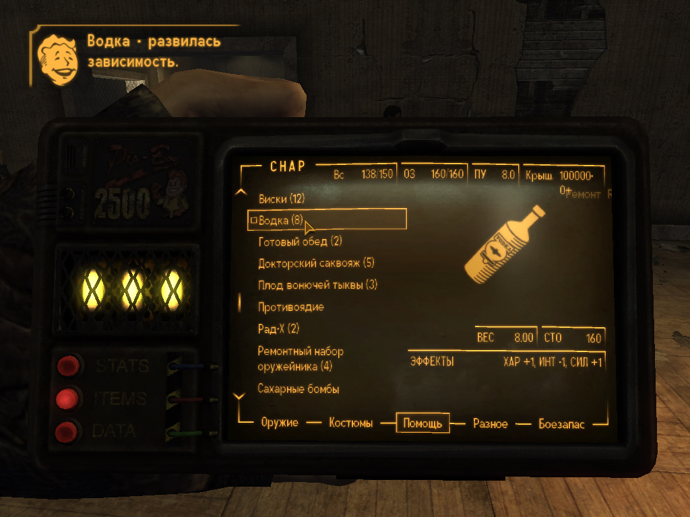
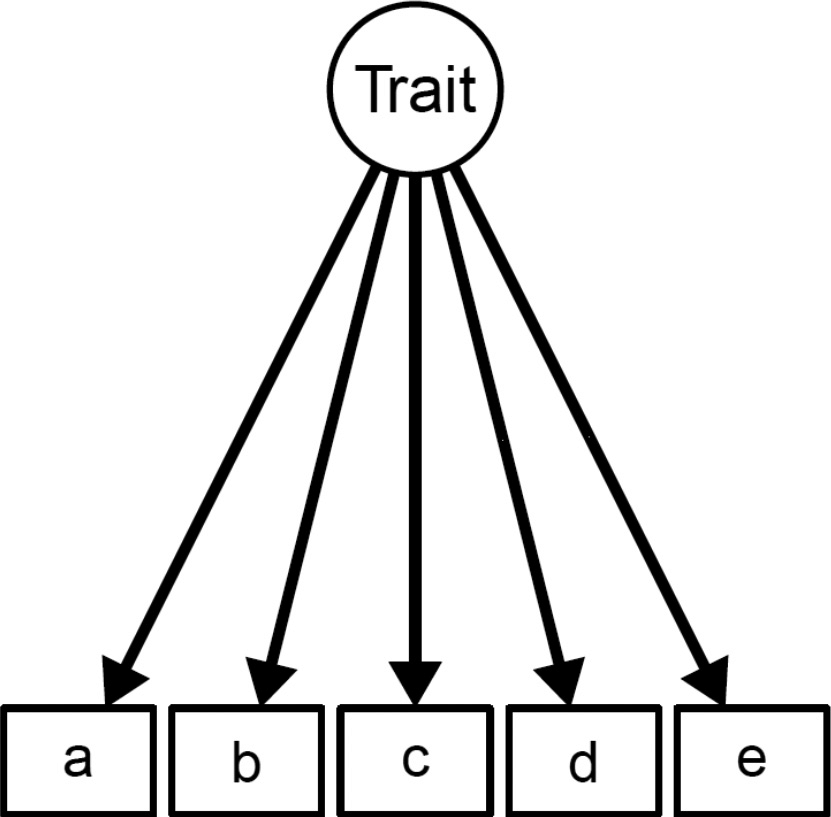

# Dependency Injection, Traits сказ о том как иметь зависимости и получать от этого удовольствие!

`— Так это и есть твоя тайна? Твое грандиозное приключение? Ты три дня валялся на пляже и хлебал ром?
— Добро пожаловать на Карибы, моя любовь.`



## Traits

Трейт - это механизм обеспечения повторного использования кода в языках с поддержкой только одиночного наследования, таких как PHP. 
Трейт предназначен для уменьшения некоторых ограничений одиночного наследования, позволяя разработчику повторно использовать наборы методов свободно, в нескольких независимых классах и реализованных с использованием разных архитектур построения классов. 
Семантика комбинации трейтов и классов определена таким образом, чтобы снизить уровень сложности, а также избежать типичных проблем, связанных с множественным наследованием и смешиванием (mixins).



Трейт очень похож на класс, но предназначен для группирования функционала хорошо структурированым и последовательным образом. 
Невозможно создать самостоятельный экземпляр трейта. 
Это дополнение к обычному наследованию и позволяет сделать горизонтальную композицию поведения, то есть применение членов класса без необходимости наследования.


[Больше про трейты](https://www.php.net/manual/ru/language.oop5.traits.php)

### Правило хорошего тона.  

Задача. 
В некоторых классах мы используем логирование. Давайте создаим трейт.

```php
<?php

use Psr\Log\LoggerInterface;

trait LoggerAwareTrait
{
    /**
     * @var LoggerInterface 
     */
    private $logger;
    
    public function setLogger(LoggerInterface $logger)
    {
        $this->logger = $logger;
        
        return $this;
    }

    public function getLogger() : LoggerInterface
    {
        return $this->logger;
    }
}
```
Пока все хорошо, теперь мы должны подключить жанный трейт к нашему классу.

```php
<?php

class Rick
{
    use LoggerAwareTrait;

}
```

Теперь класс Rick умеет логировать данные используя сторонрий класс. Но как нам это понять?
В случае если это наш код  мы знаем что модем вызвать еужные методы, но как про это может знать клеинсткий код?

Рашение проблемы. Давайте создадим интерфейс.

```php
<?php

use Psr\Log\LoggerInterface;

interface LoggerAwareInterface
{
    public function setLogger(LoggerInterface $logger);
    
    public function getLogger() : LoggerInterface;
}

```

Теперь немного модифицируем наш класс.

```php
<?php

class Rick implements LoggerAwareInterface 
{
    use LoggerAwareTrait;

}
```
 
Все теперь клиентский код без проблем узнает что наш класс умеет логировать.

```php
$rick = new Rick();

if ($rick instanceof LoggerAwareInterface)
{
    $rick->getLogger()->notice("Hello I'm Rick");
}
```


## Dependency Injection


Внедрение зависимости - процесс предоставления внешней зависимости программному компоненту. Является специфичной формой «инверсии управления» (англ. Inversion of control, IoC), когда она применяется к управлению зависимостями. В полном соответствии с принципом единственной обязанности объект отдаёт заботу о построении требуемых ему зависимостей внешнему, специально предназначенному для этого общему механизму.

Инверсия управления (англ. Inversion of Control, IoC) — важный принцип объектно-ориентированного программирования, используемый для уменьшения зацепления в компьютерных программах. Также архитектурное решение интеграции, упрощающее расширение возможностей системы, при котором поток управления программы контролируется фреймворком.

В обычной программе программист сам решает, в какой последовательности делать вызовы процедур. Но, если используется фреймворк, программист может разместить свой код в определенных точках выполнения (используя callback или другие механизмы), затем запустить «главную функцию» фреймворка, которая обеспечит все выполнение и вызовет код программиста тогда, когда это будет необходимо. Как следствие, происходит утеря контроля над выполнением кода — это и называется инверсией управления (фреймворк управляет кодом программиста, а не программист управляет фреймворком).

Инверсия управления бывает не только в фреймворках, но и в некоторых библиотеках (но обычно библиотеки не создают инверсии управления — они предоставляют набор функций, которые должен вызывать программист).


### Задача

Давайте представим что нам нужно устанавливать локаль пользователю которая передается по средствам HTTP протокола

```php
$_SESSION['language'] = 'en';

```

Код выше будет содержать локаль пользователе в сессии под ключем **language** таким образом для всех запросов нам будет доступна локаль пользователя благодаря глобальному массиву **$_SESSION**

```php
$userLanguage = $_SESSION['language'];
```

Поскольку механизм внедрения зависимостей имеет смысл только в объектно ориентированом мире, 
давайте представим что у нас есть класс SessionStorage, который является оберткой над стандартными сессиями PHP

```php
class SessionStorage
{
  function __construct($cookieName = 'PHP_SESS_ID')
  {
    session_name($cookieName);
    session_start();
  }

  function set($key, $value)
  {
    $_SESSION[$key] = $value;
  }

  function get($key)
  {
    return $_SESSION[$key];
  }

  // ...
}
```
И создадим класс User 

```php
class User
{
  protected $storage;

  function __construct()
  {
    $this->storage = new SessionStorage();
  }

  function setLanguage($language)
  {
    $this->storage->set('language', $language);
  }

  function getLanguage()
  {
    return $this->storage->get('language');
  }

  // ...
}
```

Данные классы достаточно просты в использовании

```php
$user = new User();
$user->setLanguage('fr');
$userLanguage = $user->getLanguage();
```

Все выглядит хорошо, пока вы не захотите большей гибкости. Хорошо, давайте представим что нам нужно изменить 
имя сессии. Что мы можем сделать?

1. "Захаркодить" ([Hardcode](https://en.wikipedia.org/wiki/Hard_coding)) имя для cookie в классе User в конструкторе SessionStorage

```php
class User
{
  function __construct()
  {
    $this->storage = new SessionStorage('SESSION_ID');
  }

  // ...
}
```


2. Можно объявить глобальную константу за пределами класса

```php
define('STORAGE_SESSION_NAME', 'SESSION_ID');

class User
{
  function __construct()
  {
    $this->storage = new SessionStorage(STORAGE_SESSION_NAME);
  }

  // ...
}
```

3. Добавить имя сессии к конструктору класса User

```php
class User
{
  function __construct($sessionName)
  {
    $this->storage = new SessionStorage($sessionName);
  }

  // ...
}

$user = new User('SESSION_ID');
```

4. Добавим массив опций к классу SessionStorage

```php
class User
    {
      function __construct($storageOptions)
      {
        $this->storage = new SessionStorage($storageOptions['session_name']);
      }

      // ...
    }

    $user = new User(array('session_name' => 'SESSION_ID'));
```


Все эти альтернативы плохие и не решают нашу проблему
Если мы захардкодим имя сессии в  класс User, то потом что бы опять ее поменять нам снова нужно будет править этот класс.
Использование константы тоже не очень хорошая идея т.к. тепреь класс User зависит от инициализации данной константыю
Передача параметров через аргумент конструктора, вглядит лучше, но все равно "попахивает". Потому что загромождает аргументы конструктора класса User которые не имеют отношения к самому объекту User.


Но есть еще одна проблема, которая не может быть легко решена: как я могу изменить класс SessionStorage? 
Например, заменив его на фиктивный объект, чтобы облегчить тестирование. 
Или, возможно, потому что мы захотим сохранить сеансы в таблице базы данных или в памяти. 
Это невозможно в текущей реализации, кроме случаев, когда мы напрямую меняете класс User.

Используем Dependency Injection. 
_Вместо того что бы создавать объект класса_ **SessionStorage** _внутри класса_ **User**, _мы внедрим уже созданный объект_ **SessionStorage** _в объект класса_ **User** _через аргумент конструктора_.

```php
class User
{
  function __construct($storage)
  {
    $this->storage = $storage;
  }

  // ...
}
```

**Это и есть Dependency Injection. Ничего больше!** 
Использование класса User теперь немного сложнее, так как сначала вам нужно создать объект SessionStorage:

```php
$storage = new SessionStorage('SESSION_ID');
$user = new User($storage);
```

Теперь настройка и замена объекта SessionStorage очень проста. И все это возможно без изменения класса User.

Вебсайт [Pico Container](http://picocontainer.com/injection.html) объясняет Dependency Injection вот так

`«Внедрение зависимостей - это когда компонентам присваиваются зависимости через конструкторы, методы или непосредственно в поля».`

### Виды DI

1. Constructor DI

```php
class User
{
  function __construct($storage)
  {
    $this->storage = $storage;
  }

  // ...
}
```

2. Setter injection

```php
class User
{
  function setSessionStorage($storage)
  {
    $this->storage = $storage;
  }

  // ...
}
```

3. Property injection

```php
class User
{
  public $sessionStorage;
}

$user->sessionStorage = $storage;
```

Как правило внедрение зависимостей через конструктор подходит для обязательных зависимостей, а внедрение чере setter для опциональных.
Внедрение зависимости через свойство практически не используется.

### Важная ремарка 

Поскольку понятие принцып и паттерн довольно размуты и не дают четкого определения, возникает некая путаница - DI принцып или паттерн. 
Позиция автора данной лекции такова: DI все же больще принцып как, например, принцыпы SOLID, а вот реализация различных менеджеров объектов - паттерны использующие принцип DI

### Практика 


 
